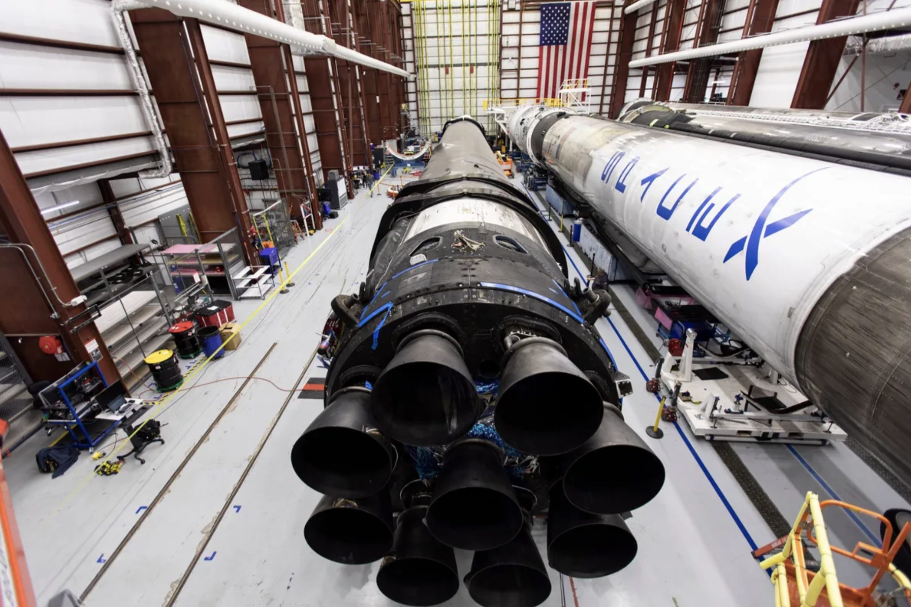
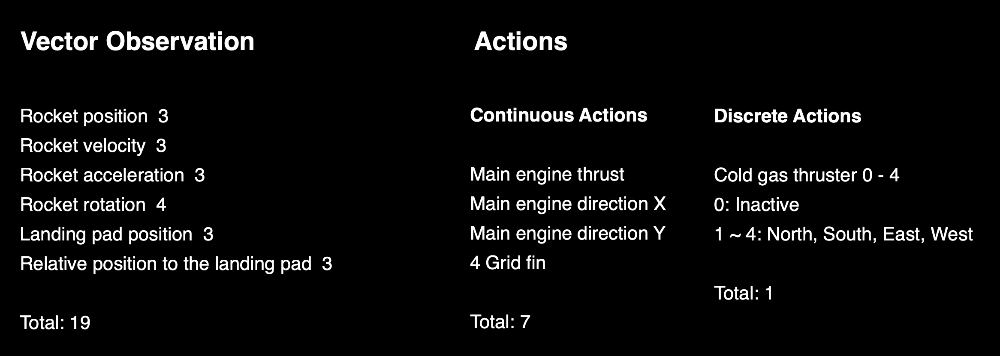
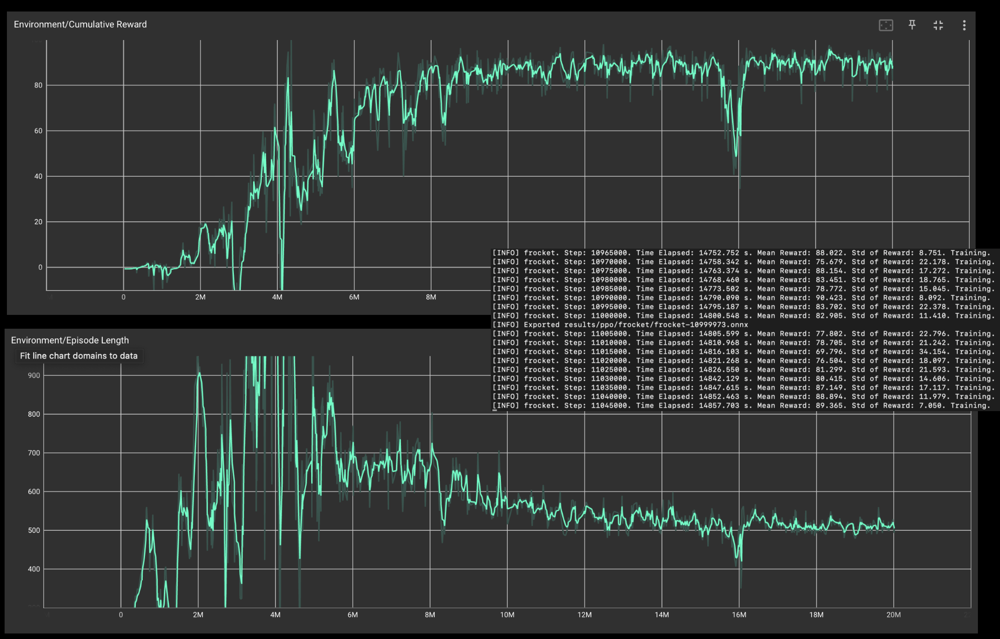
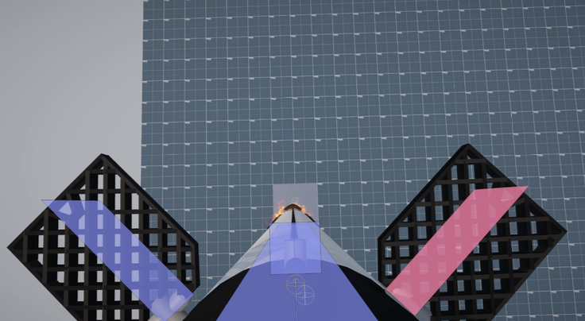
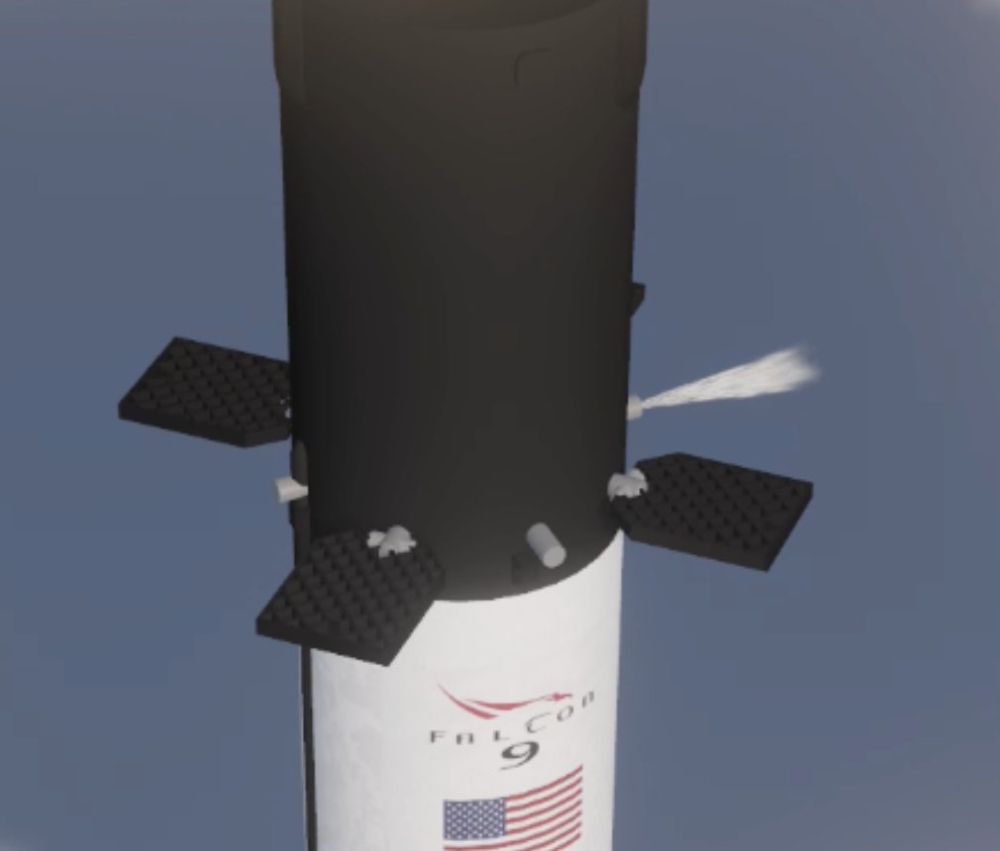
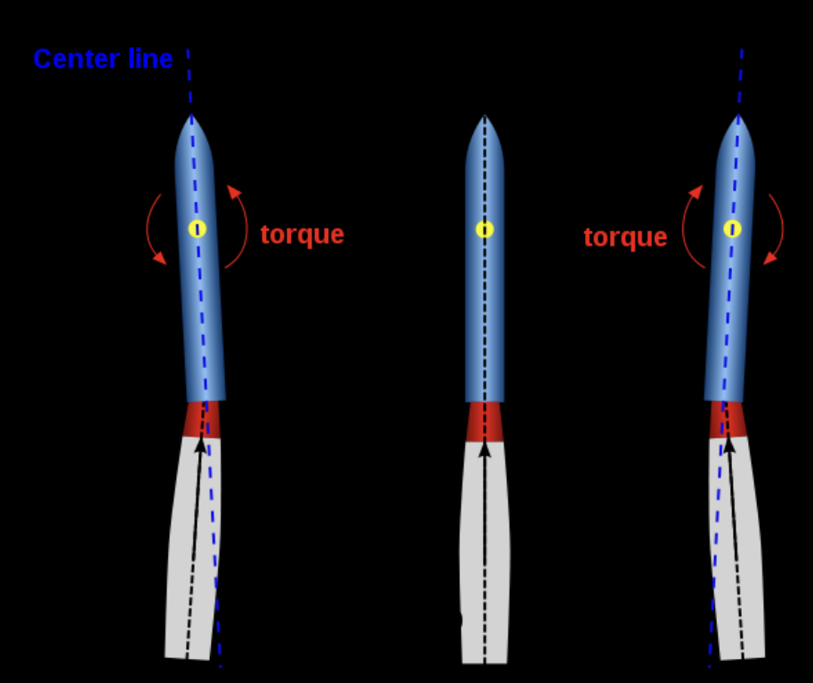
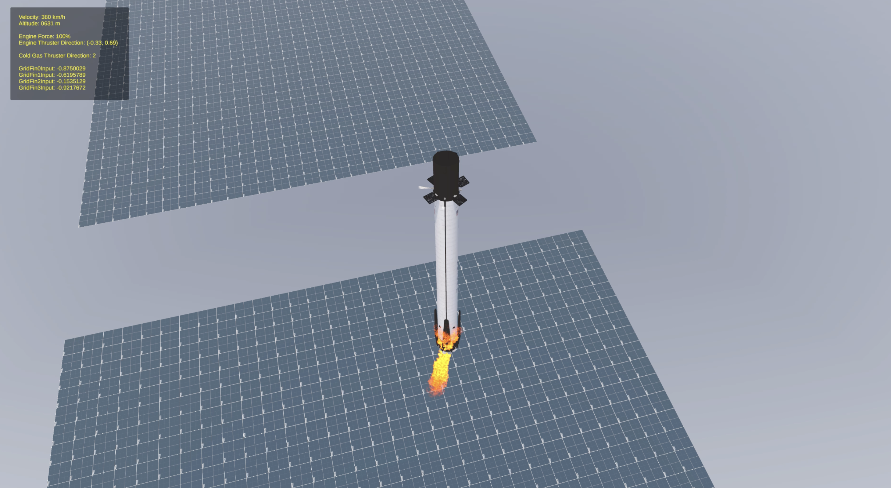
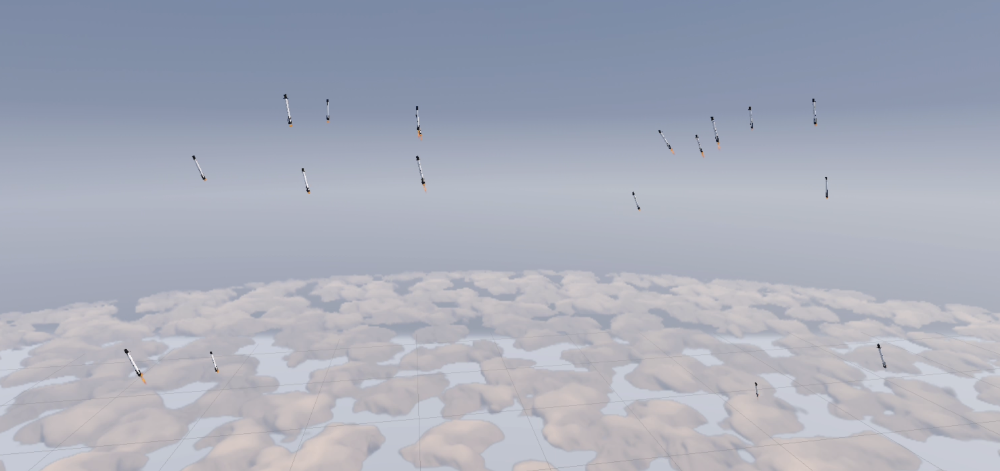
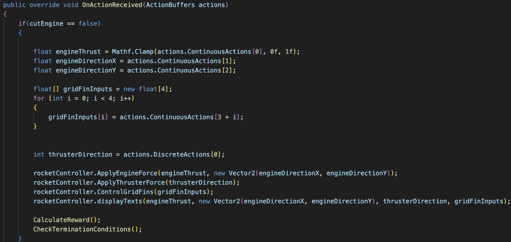
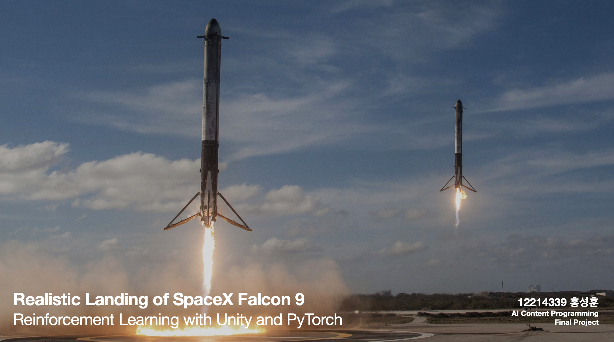

# Autonomous Rocket Landing via Reinforcement Learning : AIP Project 2024-2

A vertical landing simulation project developed for an AI Programming course. This project implements a Deep Reinforcement Learning (DRL) agent that learns to land a Falcon 9-style rocket safely on a target pad by managing high-dimensional physics and actuator states.

---

### RL & Physics Implementation

The system is built on **Unity ML-Agents** and utilizes the **PPO (Proximal Policy Optimization)** algorithm. The agent handles continuous and discrete control inputs to stabilize the rocket during its high-velocity descent.

  
  

- **State Management**: The agent processes real-time observations including 3D velocity, angular momentum, and relative altitude to calculate optimal thrust vectors.
- **Physics Integration**: Leverages a semi-custom aircraft physics model to simulate realistic aerodynamic drag and gravity-turn dynamics.
- **Decision Loop**: The decision-making process is offloaded to a PyTorch-based neural network, communicating with Unity via a low-latency socket connection during training.

### Aerodynamic & Motion Control

The rocket's hardware stack is simulated with individual control systems working in parallel.
- **Main Engine Gimbaling**: Applies proportional thrust and 2-axis rotation to manage the primary descent velocity and orientation.
- **Grid Fin Stabilization**: Simulates aerodynamic atmospheric control, providing lateral stability and steering during the supersonic/transonic phase.
- **Cold Gas Thrusters**: Discrete thrust vectoring used for fine-tuned orientation adjustments in low-density/low-speed conditions.

  
  
  

### Training Logic & Environment

The training reward function is designed using a multi-objective approach to prioritize both safety and precision.
- **Velocity Shaping**: Penalties are applied based on the vertical and horizontal speed relative to the landing pad to ensure a soft touchdown.
- **Orientation Penalties**: The agent receives negative feedback if the rocket tilts beyond safety limits, encouraging a vertical landing profile.
- **Precision Bonus**: Sparse rewards are granted based on the final distance from the target center (Landing Zone 1).

  
  

---
## Implementation

*2024-2 University Course Work / Unity 2021.3+*

**Developed by Hong Seong-Hoon**
